<!-- textura-banner -->
<div align="center">
  <a href="https://github.com/beepboop2025/ai-analytics"></a>
</div>

# DataLens AI

**AI-powered analytics platform that turns raw data into actionable insights in seconds.**


---

## Features

- **Natural Language Queries** -- Ask questions about your data in plain English. Claude and OpenAI models interpret your intent and return structured insights.
- **Automated Chart Generation** -- Bar, line, area, pie, and scatter visualizations generated directly from uploaded datasets with no manual configuration.
- **Executive Summaries** -- AI-written narratives that highlight key trends, anomalies, and ranked findings suitable for stakeholder reporting.
- **Multi-Format Data Upload** -- Supports CSV, Excel (XLSX/XLS), and JSON files with automatic schema detection and validation.
- **Time-Series Forecasting** -- ARIMA-based forecasting powered by a Python data engine with DuckDB and Polars for statistical profiling.
- **Subscription Billing** -- Self-serve subscription tiers (Free, Pro, Enterprise) managed through Stripe Checkout with usage tracking and webhook-driven lifecycle management.
- **Authentication** -- Email/password and Google OAuth via NextAuth.js 5, with email verification, password reset, and account deletion flows.
- **Statistical Profiling** -- Distribution analysis, correlation matrices, and outlier detection via DuckDB and Polars.
- **Report History** -- Save, revisit, and compare past analyses across datasets.
- **Glassmorphism UI** -- Modern interface with frosted-glass panels, gradient animations, and responsive design built on Tailwind CSS 4.

---

## Tech Stack

| Layer | Technology |
|-------|------------|
| Frontend | Next.js 16, React 19, Tailwind CSS 4, Recharts |
| AI | Anthropic Claude, OpenAI |
| Auth | NextAuth.js 5 (Google OAuth + credentials) |
| Database | Prisma 7, PostgreSQL |
| File Storage | Vercel Blob |
| Billing | Stripe (subscriptions + webhooks) |
| Data Engine | Python FastAPI, DuckDB, Polars, statsmodels |
| Email | Resend |
| Deployment | Vercel, Netlify, or Docker |

---

## Getting Started

### Prerequisites

- Node.js 18+
- PostgreSQL instance (local or hosted, e.g. Neon)
- Anthropic and/or OpenAI API key
- Stripe account (for billing features)

### Installation

```bash
git clone https://github.com/beepboop2025/ai-analytics.git
cd ai-analytics
npm install
```

### Environment Setup

Create a `.env` file in the project root with the following variables:

| Variable | Description |
|----------|-------------|
| `DATABASE_URL` | PostgreSQL connection string |
| `NEXTAUTH_SECRET` | Session encryption key |
| `ANTHROPIC_API_KEY` | Claude API key for AI analysis |
| `GOOGLE_CLIENT_ID` | Google OAuth client ID |
| `GOOGLE_CLIENT_SECRET` | Google OAuth client secret |
| `BLOB_READ_WRITE_TOKEN` | Vercel Blob storage token |
| `STRIPE_SECRET_KEY` | Stripe secret key (for billing) |
| `STRIPE_WEBHOOK_SECRET` | Stripe webhook signing secret |
| `RESEND_API_KEY` | Resend API key (for email flows) |

### Database Migration

```bash
npx prisma generate
npx prisma migrate dev
```

### Start the Development Server

```bash
npm run dev
```

The application will be available at `http://localhost:3000`.

### Python Data Engine (Optional)

For advanced statistical profiling and time-series forecasting:

```bash
cd engine
pip install -r requirements.txt
python main.py
```

The data engine runs on `http://localhost:8080` and provides DuckDB SQL queries, distribution profiling, and ARIMA forecasting.

---

## License

Source-available — free to view, study, and run locally for non-commercial use. Commercial use requires a separate license. See [LICENSE.md](LICENSE.md) for the full terms.
